# Diagrama de Secuencia - Lab5: Grafos (Dijkstra y Bellman-Ford)

## Descripción General
Este laboratorio implementa una aplicación gráfica para visualizar grafos y calcular caminos más cortos usando los algoritmos de Dijkstra y Bellman-Ford.

## Componentes del Sistema
- **main.py**: Punto de entrada de la aplicación
- **graphgui.py (InterfazGrafo)**: Interfaz gráfica principal con Tkinter
- **graph_model.py**: Algoritmos de grafos (Dijkstra, Bellman-Ford)
- **graph_drawer.py**: Funciones auxiliares para dibujo (geometría)

---

## Diagrama de Secuencia

```mermaid
sequenceDiagram
    participant U as Usuario
    participant M as main.py
    participant GUI as InterfazGrafo<br/>(graphgui.py)
    participant GM as graph_model.py
    participant GD as graph_drawer.py
    participant TK as Tkinter Canvas

    Note over U,TK: 1. INICIALIZACIÓN DE LA APLICACIÓN
    
    U->>M: Ejecutar aplicación
    M->>GUI: InterfazGrafo()
    activate GUI
    GUI->>GUI: __init__()
    GUI->>GUI: _construir_controles_superiores()
    Note right of GUI: Crea entrada tamaño, botones,<br/>checkboxes, comboboxes
    GUI->>GUI: _construir_zona_matriz()
    Note right of GUI: Canvas scrollable para matriz
    GUI->>GUI: _construir_zona_canvas()
    Note right of GUI: Canvas para visualización<br/>Panel de info y expresiones
    GUI->>GUI: crear_matriz()
    Note right of GUI: Matriz inicial 3x3
    M->>GUI: mainloop()
    GUI-->>U: Muestra interfaz inicial
    deactivate GUI

    Note over U,TK: 2. CREACIÓN/MODIFICACIÓN DE MATRIZ

    U->>GUI: Introduce tamaño n
    U->>GUI: Presiona "Crear matriz"
    activate GUI
    GUI->>GUI: crear_matriz()
    GUI->>GUI: Validar n (1-50)
    GUI->>GUI: Destruir matriz anterior
    GUI->>GUI: Crear nuevas entradas (n x n)
    Note right of GUI: nombres_def = [v1, v2, ..., vn]
    GUI->>GUI: _actualizar_opciones_nodos()
    GUI->>GUI: dibujar_grafo(None)
    GUI-->>U: Muestra matriz vacía
    deactivate GUI

    Note over U,TK: 3. INGRESO DE DATOS

    U->>GUI: Ingresa nombres de nodos
    U->>GUI: Ingresa pesos en matriz
    U->>GUI: Marca/desmarca "Dirigido"
    
    Note over U,TK: 4. VISUALIZACIÓN DEL GRAFO

    U->>GUI: Presiona "Dibujar grafo"
    activate GUI
    GUI->>GUI: dibujar_grafo(None)
    GUI->>GUI: _asegurar_nombres_iguales()
    Note right of GUI: Verifica coherencia columnas/filas
    GUI->>GUI: _leer_nombres()
    GUI->>GUI: _leer_matriz()
    
    alt Grafo Dirigido
        GUI->>GM: validar_grafo_dirigido(matriz)
        activate GM
        GM->>GM: Verificar aristas duplicadas
        GM-->>GUI: None o (i,j) duplicado
        deactivate GM
        
        alt Arista duplicada encontrada
            GUI-->>U: Advertencia duplicado
        end
    end

    alt Grafo No Dirigido
        GUI->>GUI: Normalizar matriz simétrica
        Note right of GUI: matriz[i][j] = matriz[j][i]<br/>Mantiene pesos negativos
    end

    GUI->>GUI: _actualizar_expresion(nombres, matriz, dirigido)
    Note right of GUI: Genera V=(v1,v2,...)<br/>A=((u,v,w),...)
    
    GUI->>TK: delete("all")
    GUI->>GUI: Calcular posiciones circulares
    Note right of GUI: ángulo = 2π*k/n<br/>x = cx + r*cos(ángulo)<br/>y = cy + r*sin(ángulo)
    
    loop Para cada arista (i,j) con peso != 0
        alt i == j (bucle)
            GUI->>GUI: _dibujar_bucle_variable(i, pos, centro, peso)
            GUI->>TK: create_line(curva Bézier)
            GUI->>GUI: _dibujar_etiqueta(peso)
        else Arista normal
            GUI->>GUI: _dibujar_arista(i, j, posiciones, peso, ...)
            
            alt Dirigido con retorno
                GUI->>GD: bezier_q_punto_y_tangente(p0, c, p2, t)
                activate GD
                GD-->>GUI: (x, y, dx, dy)
                deactivate GD
                GUI->>TK: create_line(curva, arrow=LAST)
            else Arista simple
                GUI->>TK: create_line(recta, arrow=LAST?)
            end
            
            GUI->>GD: offset_perpendicular(x1,y1,x2,y2,dist)
            activate GD
            GD-->>GUI: (px, py) offset
            deactivate GD
            GUI->>GUI: _dibujar_etiqueta(peso)
        end
    end
    
    loop Para cada nodo i
        GUI->>GUI: _dibujar_nodo(i, x, y, nombre)
        GUI->>TK: create_oval(círculo)
        GUI->>TK: create_text(nombre)
        GUI->>TK: tag_bind("nodo_i", click handler)
    end
    
    GUI-->>U: Muestra grafo visualizado
    deactivate GUI

    Note over U,TK: 5. INTERACCIÓN CON NODOS

    U->>GUI: Click en nodo
    activate GUI
    GUI->>GUI: _on_click_nodo(indice)
    GUI->>GUI: _resaltar_nodo(indice)
    GUI->>TK: create_oval(resalte azul)
    GUI->>GUI: _mostrar_propiedades_nodo(indice)
    
    alt Dirigido
        Note right of GUI: Adyacentes desde nodo<br/>Adyacentes hacia nodo
    else No Dirigido
        Note right of GUI: Nodos adyacentes
    end
    
    GUI-->>U: Muestra propiedades en panel
    deactivate GUI

    Note over U,TK: 6. ALGORITMO DIJKSTRA

    U->>GUI: Selecciona Origen/Destino
    U->>GUI: Presiona "Dijkstra"
    activate GUI
    GUI->>GUI: calcular_ruta_dijkstra()
    GUI->>GUI: _asegurar_nombres_iguales()
    GUI->>GUI: _leer_nombres()
    GUI->>GUI: _leer_matriz()
    
    alt No Dirigido
        GUI->>GUI: Normalizar matriz simétrica
    end
    
    GUI->>GUI: Obtener índices origen/destino
    
    alt Origen == Destino
        GUI-->>U: "Ruta trivial, distancia = 0"
    else
        GUI->>GM: construir_adyacencias(matriz, dirigido)
        activate GM
        GM->>GM: Crear lista de adyacencia
        Note right of GM: ady[i] = [(j, peso), ...]
        GM-->>GUI: adyacencias
        deactivate GM
        
        GUI->>GM: dijkstra(ady, origen, destino)
        activate GM
        GM->>GM: Inicializar dist[] = infinito
        GM->>GM: dist[origen] = 0
        GM->>GM: priority_queue = [(0, origen)]
        
        loop Mientras pq no vacía
            GM->>GM: u = heappop(pq)
            alt u ya visitado
                Note right of GM: Continuar
            else
                GM->>GM: visitado[u] = True
                
                alt u == destino
                    Note right of GM: Terminar búsqueda
                end
                
                loop Para cada vecino (v, peso) de u
                    alt peso < 0
                        GM-->>GUI: (inf, [], True)
                        Note right of GUI: Error: pesos negativos
                    else
                        alt dist[u] + peso < dist[v]
                            GM->>GM: dist[v] = dist[u] + peso
                            GM->>GM: previo[v] = u
                            GM->>GM: heappush(pq, (dist[v], v))
                        end
                    end
                end
            end
        end
        
        GM->>GM: Reconstruir camino desde previo[]
        GM-->>GUI: (distancia, camino, error_negativo)
        deactivate GM
        
        alt Pesos negativos detectados
            GUI-->>U: "Dijkstra no admite pesos negativos"
        else Sin ruta
            GUI-->>U: "No existe ruta"
        else Ruta encontrada
            GUI->>GUI: dibujar_grafo(camino)
            Note right of GUI: Resalta aristas del camino
            GUI-->>U: "Camino: v1→v2→v3 | Distancia: X"
        end
    end
    deactivate GUI

    Note over U,TK: 7. ALGORITMO BELLMAN-FORD

    U->>GUI: Selecciona Origen/Destino
    U->>GUI: Presiona "Bellman-Ford"
    activate GUI
    GUI->>GUI: calcular_bellman_ford()
    GUI->>GUI: _asegurar_nombres_iguales()
    GUI->>GUI: _leer_nombres()
    GUI->>GUI: _leer_matriz()
    
    alt No Dirigido
        GUI->>GUI: Normalizar matriz simétrica
    end
    
    GUI->>GUI: Obtener índices origen/destino
    
    GUI->>GM: construir_adyacencias(matriz, dirigido)
    activate GM
    GM-->>GUI: adyacencias
    deactivate GM
    
    GUI->>GM: bellman_ford(ady, origen)
    activate GM
    GM->>GM: Inicializar dist[] = infinito
    GM->>GM: dist[origen] = 0
    GM->>GM: previo[] = -1
    
    loop n-1 iteraciones
        loop Para cada nodo u
            loop Para cada vecino (v, peso) de u
                alt dist[u] + peso < dist[v]
                    GM->>GM: dist[v] = dist[u] + peso
                    GM->>GM: previo[v] = u
                end
            end
        end
    end
    
    Note right of GM: Detección de ciclos negativos
    loop Para cada nodo u
        loop Para cada vecino (v, peso) de u
            alt dist[u] + peso < dist[v]
                GM-->>GUI: (None, None, True)
                Note right of GUI: Ciclo negativo detectado
            end
        end
    end
    
    GM-->>GUI: (dist[], previo[], False)
    deactivate GM
    
    alt Ciclo negativo
        GUI-->>U: Error: "Ciclos negativos"
    else Sin ruta a destino
        GUI-->>U: "No existe ruta"
    else Ruta encontrada
        GUI->>GUI: Reconstruir camino desde previo[]
        GUI->>GUI: dibujar_grafo(camino)
        Note right of GUI: Resalta aristas del camino
        GUI-->>U: "Camino: v1→v2→v3 | Distancia: X"
    end
    deactivate GUI

    Note over U,TK: 8. REDIMENSIONAMIENTO DE VENTANA

    U->>TK: Redimensiona ventana
    TK->>GUI: <Configure> event
    activate GUI
    GUI->>GUI: _redibujar_si_es_posible()
    GUI->>GUI: dibujar_grafo(ultimo_camino)
    Note right of GUI: Recalcula posiciones<br/>Redibuja todo
    GUI-->>U: Grafo ajustado
    deactivate GUI
```



---

## Flujos Principales

### 1. **Inicialización**
```
main.py → InterfazGrafo.__init__() → construir controles → crear matriz inicial → mainloop
```

### 2. **Creación de Matriz**
```
Usuario input → validar n → destruir matriz anterior → crear nuevas entradas → actualizar UI
```

### 3. **Visualización**
```
Leer datos → validar consistencia → normalizar (si no dirigido) → calcular posiciones →
dibujar aristas → dibujar bucles → dibujar nodos → actualizar expresión matemática
```

### 4. **Dijkstra**
```
Validar entrada → construir adyacencias → dijkstra(origen, destino) →
priorizar con heap → relajar aristas → reconstruir camino → visualizar resultado
```

### 5. **Bellman-Ford**
```
Validar entrada → construir adyacencias → bellman_ford(origen) →
n-1 iteraciones de relajación → detectar ciclos negativos → reconstruir camino → visualizar
```

---

## Estructuras de Datos Clave

### Matriz de Adyacencia
```python
matriz[i][j] = peso  # peso != 0 → existe arista de i a j
```

### Lista de Adyacencia
```python
ady[i] = [(j1, peso1), (j2, peso2), ...]  # vecinos del nodo i
```

### Posiciones de Nodos
```python
posiciones[i] = (x, y)  # coordenadas en canvas circular
```

### Camino Resultado
```python
camino_indices = [i1, i2, i3, ...]  # secuencia de nodos
```

---

## Validaciones Importantes

1. **Tamaño de matriz**: 1 ≤ n ≤ 50
2. **Consistencia nombres**: columnas == filas
3. **Grafos dirigidos**: no duplicar aristas bidireccionales
4. **Dijkstra**: no acepta pesos negativos
5. **Bellman-Ford**: detecta ciclos negativos
6. **Normalización no dirigidos**: matriz[i][j] = matriz[j][i]

---

## Interacciones de Usuario

| Acción | Componente | Resultado |
|--------|-----------|-----------|
| Cambiar tamaño n | Entry + Botón | Recrear matriz n×n |
| Marcar "Dirigido" | Checkbox | Cambiar modo visualización |
| Dibujar grafo | Botón | Renderizar en canvas |
| Click en nodo | Canvas binding | Resaltar + mostrar propiedades |
| Dijkstra | Botón | Calcular camino más corto (sin pesos -) |
| Bellman-Ford | Botón | Calcular camino más corto (con pesos -) |
| Redimensionar | Window event | Recalcular y redibujar |

---

## Notas Técnicas

- **Geometría de dibujo**: Utiliza `graph_drawer.py` para cálculos perpendiculares y curvas Bézier
- **Aristas curvas**: Cuando hay aristas bidireccionales en grafos dirigidos, se dibujan curvas separadas
- **Bucles (self-loops)**: Se dibujan como curvas que salen y regresan al mismo nodo
- **Prioridad de capas**: Etiquetas sobre rectángulos blancos sobre aristas
- **Resaltado de caminos**: Ancho=3 y color rojo para aristas del camino encontrado
